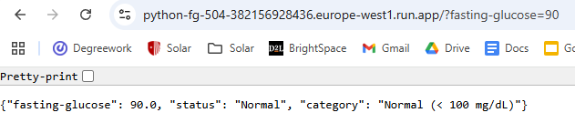

# HHA504 - Assignment 3: Multi‑Cloud Serverless Function (Fasting Glucose)
The purpose of this assignment is to implement the same HTTP serverless function in at least two cloud platforms, which I have chosen Google Cloud (Cloud Run Functions) and Microsoft Azure (Azure Functions). My function will accept JSON input describing one laboratory value that I choose, fasting glucose. I will be implementing a binary classifier that returns normal or abnormal based on a published reference range or clinical cut-point cited.

## Lab Rules for fasting glucose:
### Rules:
- " <100: normal "
- " >=100 & <= 125 : prediabetes "
- " >=126: diabetes "

### Plain English:
- Less than 100 mg/dL: This is a normal fasting blood sugar level.
- 100 to 125 mg/dL: Fasting blood sugar in this range indicates prediabetes which means your blood sugar levels are higher than normal but not high enough to be classified as diabetes.
- 126 mg/dL or above: This indicates high blood sugar and enough to be classified as diabetes.

Citation: https://my.clevelandclinic.org/health/diagnostics/21952-fasting-blood-sugar

## Zoom Recording:
https://drive.google.com/file/d/1i2joUhzgeTR2hGk7HrUouEpyxIkpbWSn/view?usp=sharing

## GCP:
### Endpoint URLs: https://python-fg-504-382156928436.europe-west1.run.app

### Steps to start before tutorial video:
1. go to cloud run
2. click "Deploy container"
3. check "fuctions"
4. give a server name
5. choose a region
6. change "Runtime" to "python 3.13"
7. check "Allow public access"
8. put maximum scaling to 1
9. click "Create" 
10. follow video

### Results:
normal:\
 \
prediabetes:\
\
diabetes:\

## Azure:
### Endpoint URLs: https://python-test-fg-cpeacta4ftfwgefu.canadacentral-01.azurewebsites.net/api/http_trigger1?code=FEbB1pk85vfo7dTRI7vb0m_ZkCm3QjP8iFWdTSJyaq29AzFu4w1hOQ==

###  Steps to start before tutorial video:
1. go to azure
2. click "Function App"
3. click "Create"
4. chose "Consumption"
5. Subscription: Azure for students
6. chose a resource group
7. give the function a name
8. pick "Python" for "Runtime stack" 
9. click "Review + Create"
10. click "Create"
11. click "open to resource"
12. click "Create function"
13. chose "HTTP trigger"
14. click "next" and then click "create"
15. follow video

### Results:
normal:\
\
prediabetes:\
\
diabetes:\

## Compare:
I think both Google Cloud Platform (GCP) and Azure is pretty straightforward and easy to create. However I do think GCP is a lot easier and more beginner friendly than Azure. The tabs were easy to navigate where the source was and where to find metrics and logs. Azure required more steps to set up and navigate. However, I like the test/run function on Azure more than GCP since you can just put in the value easier and shows output more readable instead of just in the terminal. Azure also crashed on my twice showing an error message, making me have to redo my code. Overall, I prefer GCP over Azure.
